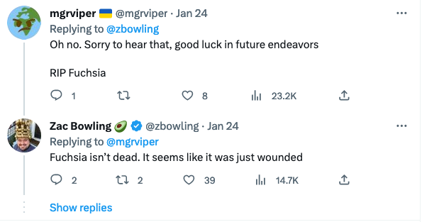

# Google's Infamous Fuchsia OS & Mass Layoffs

Google's built-from-scratch & open-source Fuchsia Operating System
might just be one of the most company's most infamous projects.

Media outlets have been probing at Fuchsia OS becoming
'the Android replacer' ever since its UI was revealed.
([1](https://www.engadget.com/2017/05/08/google-fuchsia-os-matures/),
[2](https://www.theverge.com/circuitbreaker/2017/5/8/15579846/google-fuchsia-os-magenta-armadillo-first-look-ui),
[3](http://www.androidpolice.com/2017/05/08/googles-fuchsia-operating-system-taking-shape-new-design/))

Google has released a whopping total of **four public statements**.
([1](https://www.androidpolice.com/2017/05/19/googles-dave-burke-first-rule-fuchsia-dont-talk-fuchsia/),
[2](https://www.theverge.com/2019/5/9/18563521/google-fuchsia-os-android-chrome-hiroshi-lockheimer-secrets-revealed),
[3](https://9to5google.com/2022/08/30/fuchsia-director-interview-chris-mckillop/),
[4](https://9to5google.com/2022/12/29/google-fuchsia-2023-development/))

It seems that Fuchsia OS is still an experimental project
that is pivoting and morphing into ways of use.

Actually, Fuchsia might have [its first break](https://9to5google.com/2023/01/10/google-fuchsia-launch-upcoming-device/) with the Nest Hub Max.

Although, in recent days, the future of Fuchsia got _even less clear_.

In the wake of massive layoffs, **16 percent of
its 400-person staff** took a hit.

It might be a big blow to Fuchsia,
but it's not the catastrophe of the world,
not for the laid-off people,
and definitely not for Big Tech:
- [Survey:](https://www.ziprecruiter.com/blog/laid-off-tech-workers/)
About 8 out of 10 techies, who lose their job find a new one within 3 months.
- [Factsheet](https://www.visualcapitalist.com/cp/big-tech-revenue-profit-by-company/):
While growth has halted, most FAANG companies are still reaping in massive profits
by their latest quarter statements
(_hard to sympathize, when they're sitting on mountains of cash anyway_).

Also, Google is known for starting and dropping ambitious projects.

Remember [Google Stadia](https://blog.google/products/stadia/message-on-stadia-streaming-strategy/)?

Future could be more **fuchsia**-tinted for Google's Fuchsia OS
in the light of the mass layoffs, but I find myself rooting for it.

Here's a tweet from a recently laid-off Fuchsia engineer:

